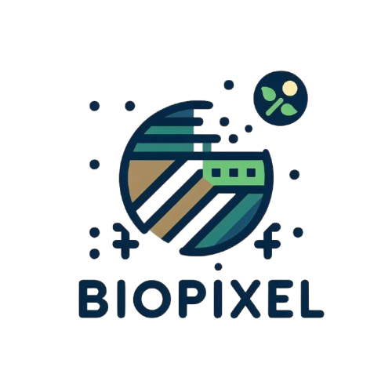

# Biopixel - Satellite Vegetation Analysis Platform



## Overview

BioPixel is a powerful web-based platform for satellite vegetation analysis that helps users analyze, visualize, and extract agricultural insights from satellite imagery. The system leverages advanced image processing techniques, data visualization, and AI-powered analysis to provide actionable intelligence about vegetation coverage, agricultural potential, and environmental conditions.

## Docker Setup

### Prerequisites
- Docker and Docker Compose installed on your system
- Git to clone the repository

### Quick Start

1. Clone the repository:
```bash
git clone https://github.com/yourusername/data-cosmos.git
cd data-cosmos
```

2. Create your environment file:
```bash
cp .env.example .env
```

3. Edit the `.env` file with your specific configuration settings and API keys.

4. Build and start the Docker container:
```bash
docker-compose up -d
```

5. Access the application:
```
http://localhost:5000
```

### Environment Variables

The application uses environment variables for configuration. You can customize these in your `.env` file:

- `SECRET_KEY`: Flask application secret key
- `FLASK_ENV`: Application environment (development/production)
- `FLASK_DEBUG`: Enable/disable debug mode (1/0)
- `PORT`: The port the application will run on

For a complete list of available environment variables, see the `.env.example` file.

### Data Persistence

The Docker setup mounts a volume at `./data` to persist uploaded files and analysis data between container restarts.

## Key Features

### 🌍 Multiple Analysis Methods
- **My Location**: Analyze vegetation at your current geographical location
- **Coordinates**: Enter specific latitude/longitude to analyze any location on Earth
- **Upload Image**: Analyze your own satellite or aerial imagery

### 📊 Comprehensive Data Visualization
- **Vegetation Gauge**: Real-time vegetation percentage visualization
- **RGB Channel Distribution**: Detailed color spectrum analysis
- **Vegetation Intensity Map**: Heatmap showing vegetation density
- **Vegetation Distribution Chart**: Statistical distribution of green leaf index
- **Weather Trends**: Integrated temperature, humidity, and precipitation data
- **Future Vegetation Projection**: Simulated forecast of vegetation development

### 🤖 AI-Powered Analysis
- **Interactive Agriculture Assistant**: Real-time Q&A with a specialized vegetation analysis AI
- **Automated Report Generation**: Comprehensive agricultural assessment reports
- **Retrieval-Augmented Generation (RAG)**: Context-aware responses based on analysis data

### 🔍 Image Processing
- **Vegetation Detection**: Advanced algorithms to identify vegetation areas
- **Vegetation Highlighting**: Visual overlay of detected vegetation
- **Vegetation Mask**: Binary representation of vegetation coverage

### 📱 User Experience
- **Responsive Design**: Works seamlessly on desktop and mobile devices
- **Float Widget Chat Interface**: Accessible AI assistant that stays out of your way
- **Intuitive Navigation**: Simple tabbed interface and clear visual hierarchy

## Technical Specifications

### Backend Components
- **Flask Web Framework**: Server-side application architecture
- **OpenCV & NumPy**: Image processing and numerical computing
- **Plotly**: Interactive data visualizations
- **Retrieval-Augmented Generation**: Context-specific AI responses

### Frontend Components
- **Tailwind CSS**: Modern, responsive UI design
- **JavaScript**: Interactive client-side functionality
- **Font Awesome**: Iconography and visual elements
- **Plotly.js**: Client-side data visualization

### AI Integration
- **LLM Connector**: Integration with language model APIs
- **Context-Aware Responses**: AI that understands specific analysis data
- **Agricultural Knowledge Base**: Specialized domain expertise in farming, crops, and land management

## Agriculture Assistant Features

The Agriculture Assistant uses RAG (Retrieval-Augmented Generation) technology to provide intelligent, data-driven responses about:

- Vegetation health and density analysis
- Agricultural potential assessment
- Suitable crop recommendations based on environmental conditions
- Land management strategies
- Weather impact on farming operations
- Seasonal planning advice
- Sustainability recommendations

The assistant is accessible via a convenient floating popup widget that:
- Stays out of the way until needed
- Provides real-time responses in a chat interface
- References specific data from your current analysis
- Offers personalized agricultural insights

## Getting Started

### Prerequisites
- Python 3.9 or higher
- pip package manager
- Internet connection for satellite imagery and AI features

### Installation

1. Clone the repository
```bash
git clone https://github.com/yourusername/data-cosmos.git
cd data-cosmos
```

2. Install dependencies
```bash
pip install -r requirements.txt
```

3. Configure environment variables
```bash
# Create a .env file with your API keys
API_KEY=your_api_key_here
```

4. Run the application
```bash
python app.py
```

5. Access the web interface
```
http://localhost:5000
```

## Use Cases

- **Agricultural Planning**: Assess vegetation coverage for farming decisions
- **Environmental Monitoring**: Track vegetation changes over time
- **Land Management**: Make informed decisions about land use and development
- **Research**: Quantify vegetation for environmental and agricultural studies
- **Education**: Visual teaching tool for environmental sciences

## Benefits

- **Data-Driven Decisions**: Make informed agricultural choices backed by data
- **Time Savings**: Automated analysis instead of manual assessment
- **Accessibility**: Complex satellite analysis made simple
- **AI-Powered Insights**: Expert agricultural knowledge without needing a specialist
- **Visual Communication**: Easy-to-understand data visualization
- **Comprehensive Overview**: Multiple data sources combined into a unified view

## Future Development

- **Time Series Analysis**: Track vegetation changes over extended periods
- **Advanced Crop Detection**: Identify specific crop types from imagery
- **Predictive Analytics**: Forecast vegetation health based on weather patterns
- **Mobile Application**: Native mobile experience for field use
- **Offline Mode**: Analysis capabilities without internet connection
- **Collaborative Features**: Share and discuss analysis results with team members

## License

This project is licensed under the MIT License - see the LICENSE file for details.

## Contact

For questions or support, reach out to datacosmos@example.com